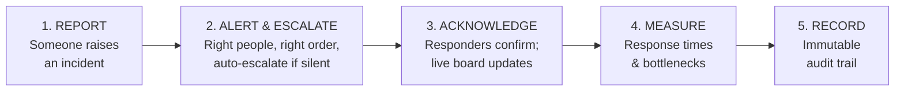
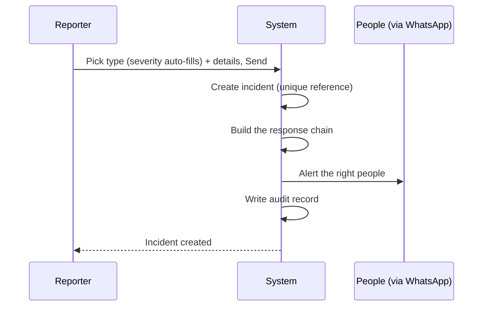
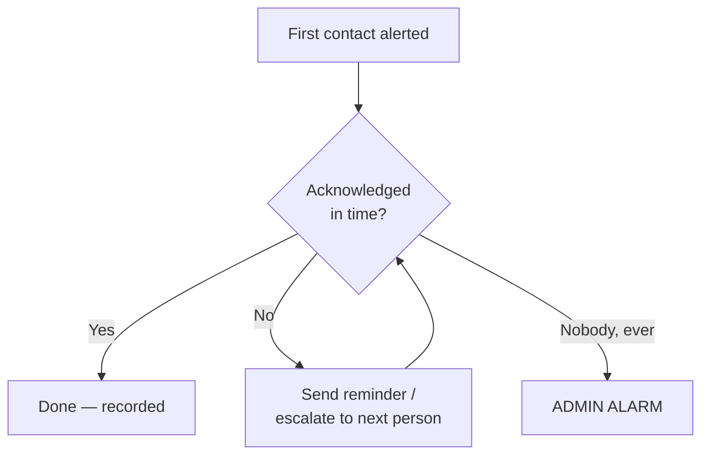
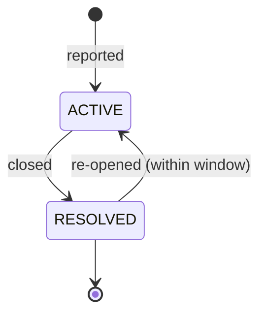
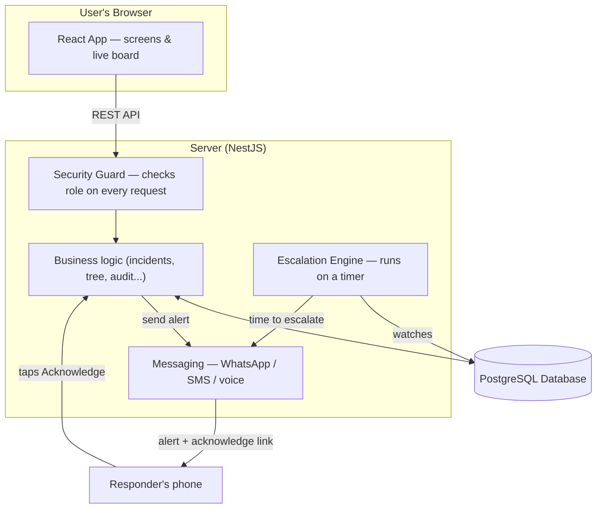

# SENTINEL
## Crisis Call-Tree & Escalation System — Project Report

*Prepared by Yuti Naha*

---

## Table of Contents
1. [Executive Summary](#1-executive-summary)
2. [The Problem I Set Out to Solve](#2-the-problem-i-set-out-to-solve)
3. [The Solution — What SENTINEL Does](#3-the-solution--what-sentinel-does)
4. [The Users (Roles)](#4-the-users-roles)
5. [How It Works — The Core Workflows](#5-how-it-works--the-core-workflows)
6. [Technology Stack — What I Used and Why](#6-technology-stack--what-i-used-and-why)
7. [System Architecture](#7-system-architecture)
8. [Data Model — What the System Stores](#8-data-model--what-the-system-stores)
9. [Security & Access Control](#9-security--access-control)
10. [Notifications — WhatsApp, Email & Beyond](#10-notifications--whatsapp-email--beyond)
11. [The "Initiate Call Tree" Broadcast Feature](#11-the-initiate-call-tree-broadcast-feature)
12. [Metrics & Reporting](#12-metrics--reporting)
13. [Audit Trail & Compliance](#13-audit-trail--compliance)
14. [The Principles I Built To](#14-the-principles-i-built-to)
15. [What Is Built vs What Comes Next](#15-what-is-built-vs-what-comes-next)
16. [Path to Production (Deployment)](#16-path-to-production-deployment)
17. [What I Need to Go Live](#17-what-i-need-to-go-live)
18. [Testing & Validation](#18-testing--validation)
19. [Glossary](#19-glossary)
20. [Conclusion](#20-conclusion)

---

## 1. Executive Summary

SENTINEL is a **crisis call-tree and escalation system** I built for the IT/Cyber function. When a serious incident occurs, the response is often chaotic — nobody is sure who to contact, whether anyone has actually seen the alert, or how long the response took, and there is no reliable record afterwards.

SENTINEL turns that chaos into an **automatic, ordered, recorded process**. A user reports an incident in a couple of clicks; the system automatically alerts the right people in the right order (over WhatsApp); if the first person does not respond in time, it escalates to the next; it shows a **live picture** of who has acknowledged; it **measures** the response; and it keeps a **permanent, tamper-proof audit trail**.

The application is **fully built and working**. I have proven the end-to-end loop, including **real WhatsApp alerts delivered to a live phone**. What remains before a company-wide rollout is standard enterprise groundwork — permissions, a security review, and hosting on company infrastructure — none of which requires the application to be rebuilt.

---

## 2. The Problem I Set Out to Solve

In a real IT or cyber crisis (a ransomware attack, a major outage, a data breach), four questions repeatedly cause delay:

- **Who do we contact first, and who is their backup if they don't answer?**
- **Did anyone actually see the alert, or is everyone assuming someone else has it?**
- **How long did we take to respond?** — usually nobody knows.
- **Six months later, can we show an auditor exactly what happened and when?** — usually not.

Every one of these costs time at precisely the moment time matters most. SENTINEL removes that uncertainty.

---

## 3. The Solution — What SENTINEL Does

The system performs five core jobs:

1. **Report** — Any authorised user reports an incident: pick a type (e.g. "Network outage"), which auto-sets a severity, add a location and description, and send. Two clicks and a sentence.
2. **Alert & Escalate** — The system messages the first responder. If they don't respond within a configured time, it automatically moves to the next person, sends reminders, and — if nobody responds at all — raises a final alarm to an administrator.
3. **Acknowledge** — Responders confirm they've seen the alert. A live board turns their name green, replacing guesswork with fact.
4. **Measure** — The system calculates how fast the team responds and where escalation chains stall.
5. **Record** — Every action and every configuration change is written to a permanent, non-editable audit log.

---

## 4. The Users (Roles)

I designed four roles, each seeing only what it needs — this is deliberate, for both privacy and security.

| Role | What they can do |
|---|---|
| **Admin** | Everything — manage the call tree, configure the system, view all incidents, metrics, and audit logs |
| **Member** | In the response chain — report, acknowledge, close incidents, and see only *their* slice of the call tree |
| **Reporter** | Raise incidents and track only the ones they reported |
| **Auditor** | Read-only oversight — view the incident log, metrics, and audit trail, but change nothing |

A key design point: when a user logs in, the **menu itself changes** to match their role, and the restrictions are enforced on the server — not merely hidden on screen.

---

## 5. How It Works — The Core Workflows

### 5.1 Reporting an incident
The reporter does two simple steps; the system does the rest behind the scenes:

**A key rule — severity decides the alerting pattern:**
- **Low severity (L0/L1)** → **Sequential**: alert the first contact only; move down one at a time if there's no response.
- **High severity (L2/L3)** → **Parallel**: alert *everyone* at once, because a serious crisis can't wait its turn. (For safety, high-severity alerts show a confirmation step before sending.)

### 5.2 The escalation engine (the automatic safety net)
This is the most important part, and it runs **by itself**, with no human involved:

- It sends reminders to people who haven't responded.
- It escalates to the next contact when someone runs out of time.
- If the **entire chain** stays silent, it fires a one-time **admin alarm** — so a fully-silent incident can never slip through unnoticed.
- The schedule is stored in the database, so if the server restarts mid-incident, it **picks up exactly where it left off** — nothing is dropped.

### 5.3 Acknowledging
Responders can acknowledge in two ways: from inside the app, or with a **single tap on a link in the alert message** — no login needed. That link is unique to one incident and one person, so it can only ever acknowledge that one person for that one incident. The moment they acknowledge, the live board updates.

### 5.4 Closing an incident
Acknowledging says *"I've seen it."* Closing says *"it's handled."* These are deliberately separate events. Closing requires a reason, stops all timers, and sends a **"stand down"** message to everyone who was alerted, so nobody keeps chasing a solved problem.

### 5.5 The two states behind everything
Every incident is just two things changing state:

And each person within an incident moves: **Waiting → Notified → Acknowledged** (or **Escalated** if they time out).

---

## 6. Technology Stack — What I Used and Why

I deliberately chose **mainstream, open-source, industry-standard** technologies at every layer — for longevity, easy maintenance, no licence costs, and a clean path to company infrastructure. A useful analogy for the three layers is a restaurant: a **dining room** (what the user sees), a **kitchen** (where the work happens), and a **pantry/records** (where everything is stored).

| Layer | Technology | In plain terms | Why I chose it |
|---|---|---|---|
| Language | **TypeScript** | JavaScript with a built-in safety net that catches mistakes before the program runs | Fewer bugs; the *same* language runs front-to-back |
| Backend (kitchen) | **NestJS** | A structured framework for the server-side logic | Enterprise-grade structure and security built in |
| Frontend (dining room) | **React + Vite** | The screens, buttons, and live dashboard | Industry standard; matches the approved design; mobile-ready |
| Database (records) | **PostgreSQL** | A reliable relational database | Trusted at scale; guarantees data integrity; free |
| Database access | **Prisma** | A safe translator between code and database | Makes database changes safe and repeatable |
| Connection | **REST API** | The fixed "menu" of requests the screen sends to the server | Universally understood; future-proof |
| Login | **JWT + bcrypt** | Token-based login; passwords stored scrambled, never in plain text | Proven security; ready to switch to company SSO later |
| Messaging | **Twilio (WhatsApp)** | Sends the actual alerts | One provider for WhatsApp, SMS, and voice calls |
| Testing | **Jest** | Automated tests that re-prove the logic on every change | Proves the safety-critical parts work |

**The single most important stack decision:** the frontend and backend are **completely separate programs** that talk only through the REST API. This means the interface can be changed without breaking the engine, and vice versa — and the whole thing can move onto company servers as a **configuration change, not a rewrite.**

---

## 7. System Architecture

Key architectural decisions I made:
- **The browser can never touch the database directly.** Every request goes through the server, where a **security guard runs first** and checks the user's role. Even if someone bypassed the on-screen buttons, the server would still refuse a forbidden action. This is "deny-by-default" security.
- **Each feature is its own self-contained module** (incidents, call tree, configuration, audit, metrics, notifications). They don't tangle together, which keeps the system easy to understand and extend.
- **The escalation engine is a separate background process** that wakes up regularly, checks which incidents are due for action, and acts — even when no user is logged in.

---

## 8. Data Model — What the System Stores

The database is the memory of the system. In plain terms, it stores these things:

| Stored item | Meaning |
|---|---|
| **User** | A login account with a role |
| **Call Tree** | A whole escalation chart (currently: IT/Cyber) |
| **Node** | A person's *position* in the tree — name, role, email, phone, order, backup, manager |
| **Incident Type** | A kind of incident and its default severity |
| **Incident** | One actual reported crisis |
| **Chain Entry** | One person's status *within* one incident (the heart of the live board) |
| **Escalation Config** | The timing rules per severity level |
| **Email/Message record** | Each alert that was generated and its delivery status |
| **Audit logs** | Two separate, permanent logs — one for user actions, one for configuration changes |

Two deliberate design choices worth highlighting:
1. **A "position in the tree" is separate from a "login account."** This lets an administrator build the chart *before* people have logged in, and keeps contact details private — a Member sees only the people immediately around them.
2. **The model supports multiple call trees and maps to corporate directory standards from day one.** The pilot uses one tree, but expanding to other departments — or syncing from the company directory (LDAP) later — is a future *feature*, not a rebuild.

Because I used a relational database, the data is always internally consistent: an acknowledgement cannot exist without an incident, each person appears in an incident only once, and each acknowledge link is unique across the whole system.

---

## 9. Security & Access Control

Security is enforced in layers:
- **Server-side role checks on every request** — a forbidden action is refused with a "403 Forbidden", even if called directly, not just hidden on screen.
- **Contact privacy** — a Member's data never exposes people outside their immediate slice of the tree.
- **Scrambled passwords** — passwords are one-way hashed (bcrypt); even someone who saw the database couldn't read them.
- **Secure, single-purpose acknowledge links** — the tap-to-acknowledge link is tied to one incident and one person and can do nothing else.
- **Secrets are never stored in the code** — all sensitive values (database credentials, messaging keys) are supplied by the environment, so nothing sensitive lives in the repository.

Before real employee data is ever loaded, an **independent security review / penetration test** is planned — this is a deliberate gate, not an afterthought.

---

## 10. Notifications — WhatsApp, Email & Beyond

I designed the notification system to be **pluggable** — the channel can be swapped by changing one setting, with no code change to the rest of the system.

- **WhatsApp (proven):** I integrated Twilio's WhatsApp channel and **proved a real crisis alert being delivered and read on a live phone**, including the acknowledge link.
- **Email:** available as an alternative channel (used during earlier testing).
- **SMS and voice calls:** the same design supports adding these — voice calls are especially well-suited to a crisis tool ("the system rings you"). These become available once a paid messaging account with a sender number is in place.

**Why this matters:** in production, the system can send **WhatsApp first, then SMS, then an automated phone call** as a layered fallback — so an alert reaches the person even if one channel fails. That escalating, multi-channel reach is exactly what a crisis tool needs, and it's all through one integration.

---

## 11. The "Initiate Call Tree" Broadcast Feature

Beyond one-by-one escalation, I built a **broadcast/cascade** capability for major crises. Instead of contacting people one at a time, an authorised user can **alert a whole group at once**:

- **Everyone below them** in the tree,
- **Everyone above them**, or
- **The whole tree** — from the top down to everyone.

Critically, **each recipient's backup is also notified**, so a "broken" (unavailable) node is still covered. Every activation is recorded in the audit trail and surfaced in the notifications feed, and the system reports exactly who was reached. This is the "declare a major incident and cascade to everyone instantly" capability.

---

## 12. Metrics & Reporting

The system computes performance from **real recorded timestamps** — never estimates:

- **MTTA (Mean Time To Acknowledge)** — how fast the team *notices* an alert.
- **MTTR (Mean Time To Resolve)** — how fast the team *fixes* it.
- **Delivery and acknowledgement rates.**
- **Per-hop latency with the "breaking node" flagged** — pinpoints exactly where chains stall.

These can be exported (CSV) for sharing with leadership. Because acknowledging and closing are separate events, the two different speeds — noticing vs fixing — are measured honestly and separately.

---

## 13. Audit Trail & Compliance

Every user action (report, acknowledge, close, re-open, override, chain edit) and every configuration change (timers, mappings, tree edits) is written to a **permanent, append-only log** that **cannot be edited or deleted through the application**. The two logs are kept separate, so a question like *"who changed the escalation timeout?"* is answerable at a glance. Records are retained for at least 18 months. This is what makes the system trustworthy for auditors and regulators.

---

## 14. The Principles I Built To

Before building, I set nine non-negotiable principles that every part of the system had to obey. In summary:

1. **Server-enforced least privilege** — security lives on the server, not just the screen.
2. **Contact privacy by design** — people see only what they need.
3. **Immutable, complete audit** — everything is logged and un-editable.
4. **Acknowledge ≠ Close** — two distinct events, measured separately.
5. **Directory-ready, multi-tree data model** — built to grow without a rewrite.
6. **Honest limitations** — the system never overstates itself ("delivered" means the provider accepted the message, nothing more).
7. **Walking skeleton first** — build the whole end-to-end path early, then broaden.
8. **Configurable, not hard-coded** — timings and policies are settings, not buried in code.
9. **Design fidelity** — the interface matches the approved prototype.

These principles are the reason the system is trustworthy, honest, and built to last.

---

## 15. What Is Built vs What Comes Next

**Built and working (Phase 1):**
- Full incident lifecycle (report → escalate → acknowledge → override → close → re-open)
- Automatic escalation engine with reminders and admin alarm
- Live dashboard, four roles, call-tree management, configuration
- Metrics, exports, complete audit trail
- Real WhatsApp alerts (proven), plus the broadcast "Initiate Call Tree" feature
- Automated tests over the critical paths
- A complete **deployment package** (Docker + guide) so the IT team can host it easily

**Deliberately reserved for Phase 2 (not a limitation, a roadmap):**
- SMS / WhatsApp at company scale and a mobile app
- Automatic population of the tree from the company directory (LDAP/Active Directory)
- Routing different incident types to different departments' towers
- Business-hours-aware escalation chains

---

## 16. Path to Production (Deployment)

Moving from the pilot to a company server is a **deployment and configuration** task, not a rewrite. To make this straightforward, I have prepared a complete **deployment package** — a Docker setup (`Dockerfile.api`, `Dockerfile.web`, `docker-compose.yml`) plus a step-by-step guide (`DEPLOYMENT.md`) and a configuration template (`.env.deploy.example`) — so the company's IT team can host the whole stack (database, backend, and frontend) with a single command.

The deployment steps are:

1. The company provides the infrastructure — a server or cloud, a managed database, and a web address with a security certificate.
2. The application is packaged into **standard containers** that run identically anywhere (provided and ready in the repository).
3. It is started with one command and configured by pointing settings at the company's own database, messaging, and address — **no code changes**.
4. The database tables are created automatically, the starter data is seeded, single-sign-on and the domain are connected, and it is tested with dummy data.
5. After the security review passes, real data is loaded and it goes live.

**Connecting WhatsApp is configuration, not code:** the messaging channel is already built in; the IT team simply supplies their own WhatsApp/Twilio credentials as settings and restarts — no source changes required.

The application is self-contained: it runs in its own isolated space and touches only its own database, so it cannot affect other systems on the server.

---

## 17. What I Need to Go Live

The build is done. To run a real pilot and then go live, I need the following from the organisation:

**To start a real pilot:**
- The real people in the IT/Cyber chain, with their contact details (and consent)
- The list of incident types and the severity for each
- The escalation timings

**Approvals:**
- Executive sponsor and go-live sign-off
- Permission to store real contact data and send real alerts
- Data-protection sign-off (DPIA / GDPR / works council / DPO)
- An independent security review before real data is used

**Production infrastructure:**
- Hosting with high availability and backups
- The company mail relay and/or a paid messaging provider
- A web address + certificate, single-sign-on, and directory access
- Monitoring, an owner/support model, and a budget

---

## 18. Testing & Validation

I validated the system at several levels:
- **Automated tests** covering the critical end-to-end paths and the role-permission rules.
- **Manual end-to-end validation** of the full lifecycle on the live application.
- **A proven real-world message:** a live WhatsApp crisis alert delivered and read on an actual phone, confirming the entire chain from the app through to a real device works.

The system is honest about what it does not yet prove at scale (multi-person live messaging and production load), and those are clearly identified as next steps rather than glossed over.

---

## 19. Glossary

| Term | Meaning |
|---|---|
| **Call tree** | The ordered list of who to contact, and in what order |
| **Escalation** | Automatically moving to the next contact when someone doesn't respond in time |
| **Node** | A person's position in the call tree |
| **Severity (L0–L3)** | How serious an incident is; decides who is alerted and how |
| **Acknowledge** | "I have seen this alert" (drives MTTA) |
| **Close** | "This is handled" (drives MTTR) |
| **MTTA / MTTR** | Mean time to acknowledge / to resolve |
| **Admin alarm** | The final alert when nobody in the chain responds |
| **Audit trail** | The permanent, un-editable record of everything that happened |
| **REST API** | The standard way the screen and the server communicate |
| **SSO / LDAP** | Company single-sign-on / the corporate employee directory |

---

## 20. Conclusion

SENTINEL delivers a complete, working solution to a real operational risk: the confusion and delay in the first minutes of an IT or cyber crisis. It alerts the right people in the right order, escalates automatically so nothing is ever silently missed, shows a live and honest picture of the response, measures performance, and keeps a trustworthy record for compliance.

The application is built on mainstream, open-source technology, follows a strict set of security and privacy principles, and is designed from the ground up to move onto company infrastructure and to grow — to more departments, more channels, and directory integration — without being rebuilt.

The engineering is complete and proven end-to-end. The remaining steps — permissions, a security review, and production hosting — are the standard organisational and infrastructure gates that turn a validated pilot into a live company service. I am ready to take it through them.
