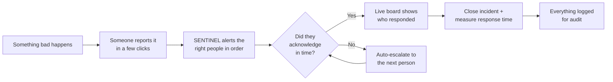
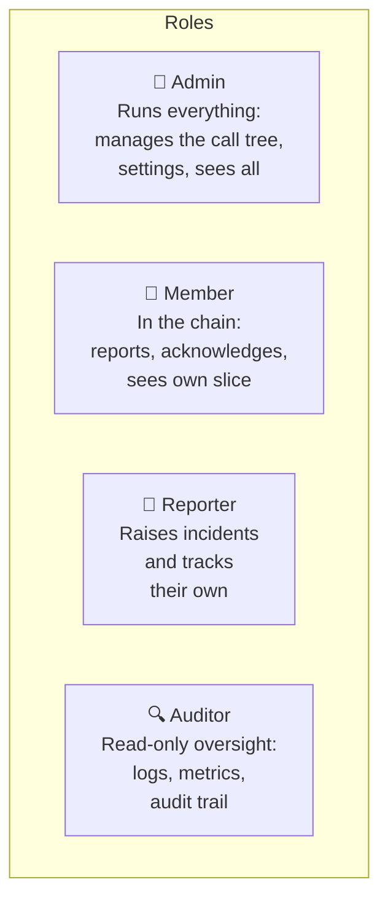

# 01 — Overview: What SENTINEL Is and Why It Exists

## The problem (in one picture)

When a serious IT or cyber incident happens — say a ransomware attack or a major outage — the response is often chaos:

- Who do we call **first**? Who's their **backup** if they don't pick up?
- Did anyone **actually** see the alert, or is everyone assuming someone else has it?
- **How long** did it take us to respond? Nobody really knows.
- Six months later, an auditor asks *"show me what happened and when"* — and there's no record.

That confusion costs time exactly when time matters most.

## The solution

SENTINEL turns that chaos into an **automatic, ordered, recorded process**:

Think of it as a **fire alarm with a phone tree built in** — but one that never forgets a step, never assumes someone else made the call, and writes down everything it did.

## What it actually does (the five core jobs)

1. **Report** — Any staff member reports an incident: pick a type (e.g. "Network outage"), it auto-picks a severity, add a location and description, send. Two clicks and a sentence.
2. **Alert & escalate** — The system emails the first responder. No reply within the set time? It automatically moves to the next person in the chain, sends reminders, and — if *nobody* responds — fires a final alarm to an administrator.
3. **Acknowledge** — Responders click **"Acknowledge"** (even straight from the email, no login needed). A live board turns their name green, so everyone sees the truth instead of guessing.
4. **Measure** — It calculates how fast the team responds (MTTA = time to acknowledge, MTTR = time to resolve) and where chains stall.
5. **Record** — Every action and every configuration change is written to an immutable audit log, kept for compliance.

## The four kinds of user (roles)

Each role sees only what it needs — this is deliberate (privacy + security). A Reporter can't see the call tree; an Auditor can look but never touch.

## What "Phase 1" means (scope, honestly)

- **One call tree**: the IT/Cyber team. (The system is built to hold *many* trees later — the pilot just uses one.)
- **Email only**: SMS/WhatsApp/mobile app are **Phase 2**, deliberately out of scope now.
- **A sanctioned pilot, not a hardened production system yet.** It's a real, working application — but going live on real company-wide data needs Sodexo's servers, mail relay, security review, and legal sign-off (all listed in the stakeholder discovery doc). We're honest about this line.

## Why this matters to Sodexo
- **Faster response** in a real crisis → less damage.
- **No more "I thought you had it"** → a live, shared source of truth.
- **Proof for auditors and regulators** → every action timestamped and retained.
- **Measurable** → you can show leadership the team is getting faster.

---
🎤 **If a stakeholder asks "what is this, in one line?"**
> "It's an automated crisis call-tree: it alerts the right IT responders in the right order, escalates automatically if someone doesn't answer, shows live who has acknowledged, and logs everything for audit."

➡️ Next: [02 — Tech Stack, the *why*](02_TECH_STACK_WHY.md)
