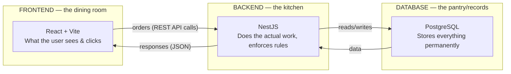

# 02 — Tech Stack: What Each Piece Is, and *Why* We Chose It

This is the doc to read before any stakeholder meeting. For each technology: **what it is** (plain words), **why we picked it**, **what we chose it over**, and **what to say if asked**.

## The big picture first

Every web application has three layers. A useful analogy is a **restaurant**:

- **Frontend** = the dining room the customer sees (buttons, screens).
- **Backend** = the kitchen where the real work happens and the rules are enforced.
- **Database** = the pantry and record books where everything is stored.

They talk through a **REST API** — a fixed "menu" of requests the dining room can send to the kitchen. Keeping them separate means you can redecorate the dining room without touching the kitchen.

---

## The choices, one by one

### 1. TypeScript — *the language everything is written in*
- **What it is:** JavaScript (the language of the web) but with a **safety net** that catches mistakes *before* the program runs. It checks that you don't, say, treat a date as a number.
- **Why we chose it:** Fewer bugs, and it makes the code self-documenting. Crucially, the **same language runs on both the frontend and the backend** — one skill set, shared code.
- **Over what:** Plain JavaScript (no safety net) or a split like Python-backend + JS-frontend (two languages to maintain).
- 🎤 *"One language, front to back, with built-in error-checking — fewer bugs, easier to hand over."*

### 2. NestJS — *the backend framework (the kitchen's organisation)*
- **What it is:** A structured framework for building the backend. It enforces a tidy, modular layout — each feature (incidents, call tree, audit…) is its own self-contained module.
- **Why we chose it:** A crisis tool needs **strict rules and clean structure**. NestJS has built-in support for exactly what we need: role-based security guards, request validation, and dependency organisation. It scales from a pilot to enterprise without a rewrite. It's the industry-standard "serious" Node.js framework.
- **Over what:** Express (too bare — you'd hand-build all the structure and security scaffolding) or a heavier Java/.NET stack (slower to build a pilot, more infrastructure).
- 🎤 *"NestJS gives us enterprise structure and security out of the box — the same framework big companies use — so the pilot is built on production-grade foundations, not a throwaway prototype."*

### 3. React + Vite — *the frontend (the dining room)*
- **What React is:** The world's most widely used library for building web interfaces. It builds screens from reusable "components" (a button, a card, a modal) — build once, use everywhere.
- **What Vite is:** The tool that runs and builds the React app; it's fast and modern.
- **Why we chose them:** The prototype was already an approved HTML design — React lets us reproduce it **exactly** while making it interactive and maintainable. Being the most popular choice means the biggest talent pool to maintain it later, and a clean path to a **mobile app** in Phase 2 (React Native reuses the same skills).
- **Over what:** Angular/Vue (fine, but smaller communities and no reuse benefit here) or plain HTML/JS (unmaintainable as it grows).
- 🎤 *"React is the industry-standard UI technology — it matches the approved design exactly, is easy to hire for, and opens the door to a mobile app later."*

### 4. PostgreSQL — *the database (the record books)*
- **What it is:** A powerful, free, open-source **relational** database. "Relational" means data lives in linked tables (people, incidents, acknowledgements) with enforced connections between them.
- **Why we chose it:** A crisis system lives or dies on **data integrity** — you cannot have an acknowledgement pointing to an incident that doesn't exist. PostgreSQL guarantees these links, handles the audit trail and 18-month retention, and runs the metrics calculations. It's trusted at the largest scale and every major cloud offers a managed version (easy for Sodexo to host).
- **Over what:** A document database like MongoDB (weaker at enforcing the strict relationships a call tree needs) or a lightweight file database like SQLite (not built for a shared, always-on server).
- 🎤 *"PostgreSQL is the trusted open-source standard for data that must be correct and auditable — no licence cost, and Sodexo's cloud can host a managed, backed-up version directly."*

### 5. Prisma — *the translator between code and database*
- **What it is:** A tool that lets the backend read and write the database safely, and manages **schema migrations** (versioned, repeatable changes to the database structure).
- **Why we chose it:** It gives us type-safety all the way into the database (the error-checking net extends to our data), and makes structure changes reproducible — the same change applies identically on your laptop and on Sodexo's server.
- 🎤 *"Prisma makes database changes safe and repeatable, so moving from pilot to production is reliable, not risky."*

### 6. REST API — *how the dining room orders from the kitchen*
- **What it is:** The agreed "menu" of requests: `report an incident`, `acknowledge`, `get the call tree`, etc. There are **31 such endpoints** grouped by feature.
- **Why we chose it:** REST is the **most universally understood** way to connect a frontend and backend. Any future client (a mobile app, another Sodexo system) can plug into the same menu. It keeps the two sides independent.
- **Over what:** GraphQL/tRPC (powerful but more complex and less universally known — unnecessary at this scale, and harder for a new team to pick up).
- 🎤 *"A standard REST API means anything — a mobile app, another internal system — can connect to it later using the most common web standard there is."*

### 7. JWT + bcrypt — *login and password security*
- **What JWT is:** After you log in, the server gives your browser a signed digital "wristband" (a token) that proves who you are on each request, so you don't re-enter your password every click.
- **What bcrypt does:** Passwords are never stored as-is — they're run through a one-way scrambler, so even someone who saw the database couldn't read them.
- **Why:** Standard, proven login security. And it's built behind an interface so it can be **swapped for Sodexo's SSO** (Azure AD / Okta) later without rebuilding.
- 🎤 *"Standard token-based login with properly hashed passwords now, and it's built to switch to Sodexo single-sign-on later without rework."*

### 8. Jest — *automated testing*
- **What it is:** A tool that automatically re-runs a suite of tests to prove the system still behaves correctly after every change.
- **Why:** For a safety-critical tool, you must **prove** the escalation logic and the security rules work — and keep proving it as you build. We have an end-to-end test suite covering the critical paths.
- 🎤 *"Automated tests prove the escalation and permission rules work, and re-prove it on every change — safety you can demonstrate, not just claim."*

### 9. npm workspaces (monorepo) — *how the project is organised*
- **What it is:** Frontend, backend, and shared code live in **one repository** in separate folders (`apps/web`, `apps/api`, `packages/shared`), managed together.
- **Why:** The frontend and backend can **share the exact same data definitions** (so they never disagree about what an "incident" looks like), and it's one place to clone, one place to version.
- 🎤 *"One organised repository where the frontend and backend share definitions — they can't drift out of sync."*

### 10. GitHub Spec Kit — *how we build it, feature by feature*
- **What it is:** A disciplined process: for each feature we write a **spec → plan → tasks → then implement**, all traced back to the original requirements.
- **Why:** It keeps the build **anchored to the agreed spec** — nothing invented, nothing lost — and produces a paper trail of *why* each feature is the way it is. Ideal when you'll answer to stakeholders.
- 🎤 *"Every feature is spec'd and traced back to the requirements before it's built — disciplined, documented, auditable development."*

---

## One-slide summary table

| Layer | Technology | The reason in six words |
|---|---|---|
| Language | TypeScript | Same safe language, front to back |
| Backend | NestJS | Enterprise structure & security built-in |
| Frontend | React + Vite | Industry standard, matches design, mobile-ready |
| Database | PostgreSQL | Trusted, free, correct, auditable |
| DB access | Prisma | Safe, repeatable database changes |
| Connection | REST API | Universal, future-proof, decoupled |
| Security | JWT + bcrypt | Proven login, SSO-ready |
| Testing | Jest | Prove the safety-critical logic |
| Structure | npm workspaces | Shared definitions, one repo |
| Process | Spec Kit | Traceable, documented build |

## The theme across every choice
Notice the pattern: each pick is the **mainstream, well-supported, open-source standard**, chosen for **longevity, hireability, and a clean path from pilot to production** — never anything exotic. That is deliberate: this must outlive the person who built it.

---
🎤 **If a stakeholder asks "why should we trust this stack for years?"**
> "Every layer is a mainstream, open-source industry standard with huge communities — React, NestJS, PostgreSQL. Nothing exotic, no vendor lock-in, no licence fees, and easy to hire for. It's designed to move onto Sodexo's own infrastructure and to be maintained by any competent web team."

➡️ Next wave: [03 — Architecture](03_ARCHITECTURE.md)
