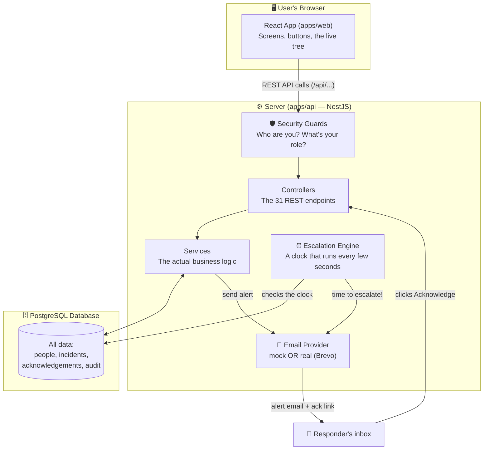
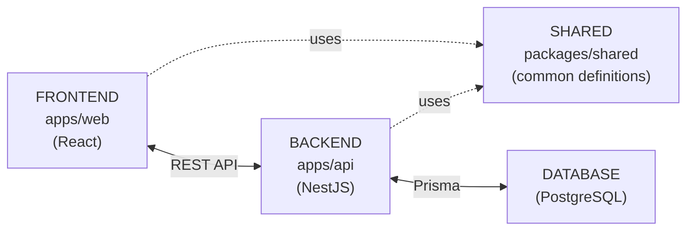
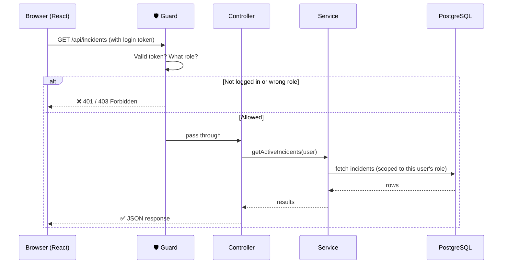
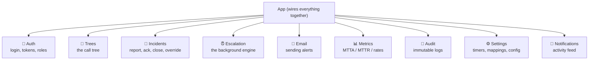
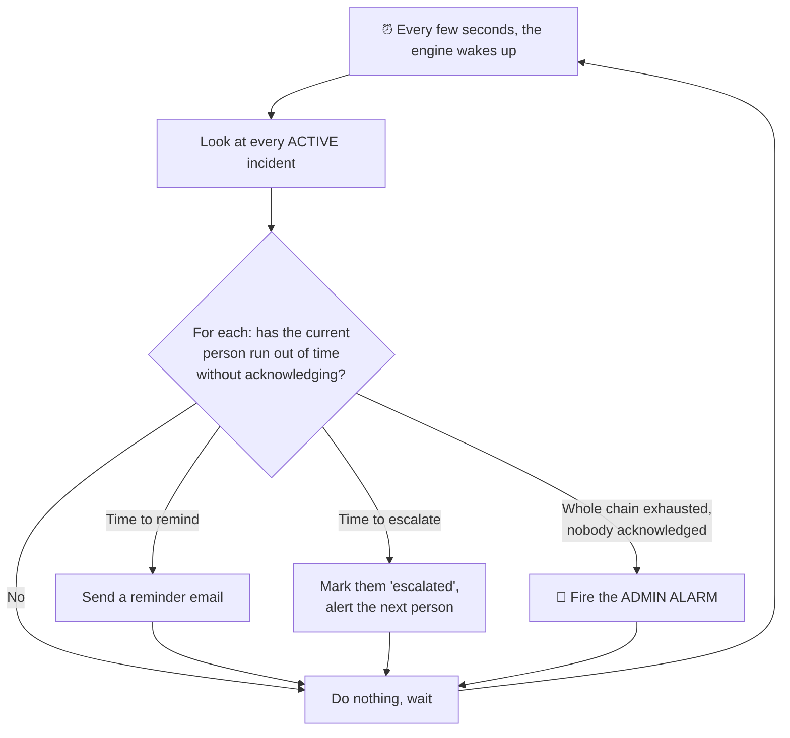
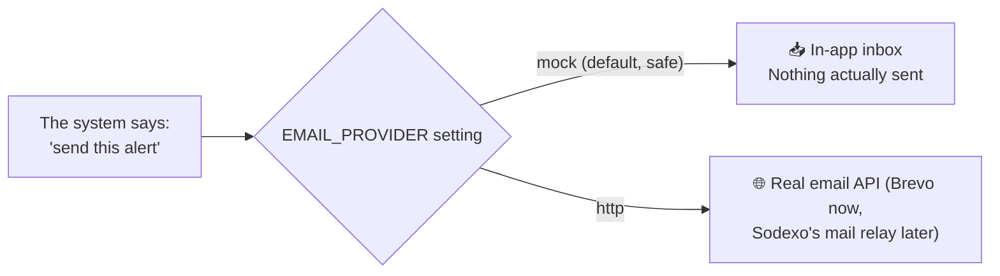
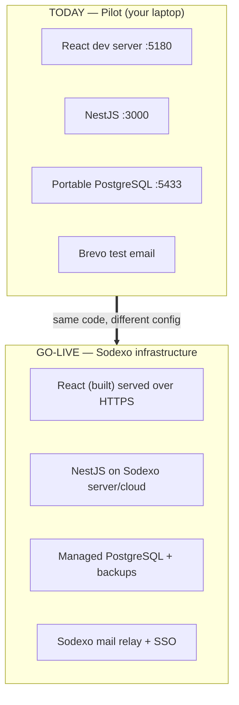

# 03 — Architecture: How the Pieces Fit Together

Wave 1 told you *what* the technologies are. This tells you *how they're wired together* — and, importantly, **where the rules are enforced** and **how the automatic escalation runs by itself**.

## The whole system on one page

Read it top to bottom: the **browser** sends requests, a **guard** checks them, a **controller** receives them, a **service** does the work against the **database**, and a separate **engine** watches the clock in the background to escalate automatically.

## The three-layer separation (why it lasts)

- **Frontend and backend are separate programs.** They only talk through the REST API. You can rebuild one without breaking the other (this is what we discussed earlier).
- **`packages/shared`** holds the definitions both sides agree on (what an "incident" or a "severity" is), so they can never disagree.
- **The backend is the only thing that touches the database.** The browser can *never* reach the data directly — it must go through the guarded backend. That's a security cornerstone.

## What happens on a single request (the lifecycle)

Here's exactly what happens when a logged-in Member opens the live escalation tree:

The key idea: **the guard runs first, on every single request.** Security isn't a screen we hide in the frontend — it's enforced on the server before any work happens. Even if someone bypassed the UI and called the API directly, the guard would still stop them. This is called **"deny-by-default"** — nothing is allowed unless a role is explicitly permitted.

## Inside the backend: modules (one per feature)

NestJS organises the backend into **modules** — each feature is its own self-contained box. They don't tangle together:

Each module has the same internal shape: a **Controller** (receives the web request) → a **Service** (does the logic) → **Prisma** (talks to the database). This sameness is why a new developer can find their way around quickly.

## The Escalation Engine — the part that runs by itself

This is the cleverest and most safety-critical piece, so it's worth understanding well.

Most of the system only does something when a user clicks. But escalation must happen **even when nobody is looking** — if the first responder ignores the alert at 3am, the system itself must move on to the next person. So there's a background **engine**:

Two design details worth knowing:
1. **The decision logic is a pure function** called `processDue(now)` — you give it the current time, it decides what's due. This makes it **testable**: we can feed it "pretend it's 10 minutes later" and check it does the right thing, without waiting 10 real minutes. That's how we prove the safety-critical logic works.
2. **The schedule lives in the database, not in memory.** If the server restarts mid-incident, it reads the incident state back from PostgreSQL and carries on — a crash doesn't drop an active crisis.

🎤 **If a stakeholder asks "what if the server restarts during an incident?"**
> "The escalation schedule is stored in the database, not in the server's memory. On restart it reads the active incidents back and continues escalating — nothing is lost."

## The Email Provider — swappable by design

Notice in the diagrams that "Email" is one box. Behind it are **two interchangeable versions**, chosen by a single setting (`EMAIL_PROVIDER`):

The rest of the system doesn't know or care which one is active — it just says "send." This is why switching from the test provider to **Sodexo's real mail server** at go-live is a **configuration change, not a code change**.

## Where it runs: pilot vs production

**The critical point: the boxes on the right run the *exact same application code* as the boxes on the left.** Only the surroundings (where it's hosted, which database, which mail server, how you log in) change — and all of those are already read from configuration, not hard-coded.

---
🎤 **If a stakeholder asks "is this architecture solid enough to build on?"**
> "Yes — it's the standard layered web architecture: a separate frontend and backend talking over a REST API, all security enforced server-side on every request, features cleanly separated into modules, and the automatic escalation built as a testable, crash-resilient background engine. Nothing about it needs re-architecting to go to production."

➡️ Next: [04 — Data Model](04_DATA_MODEL.md)
