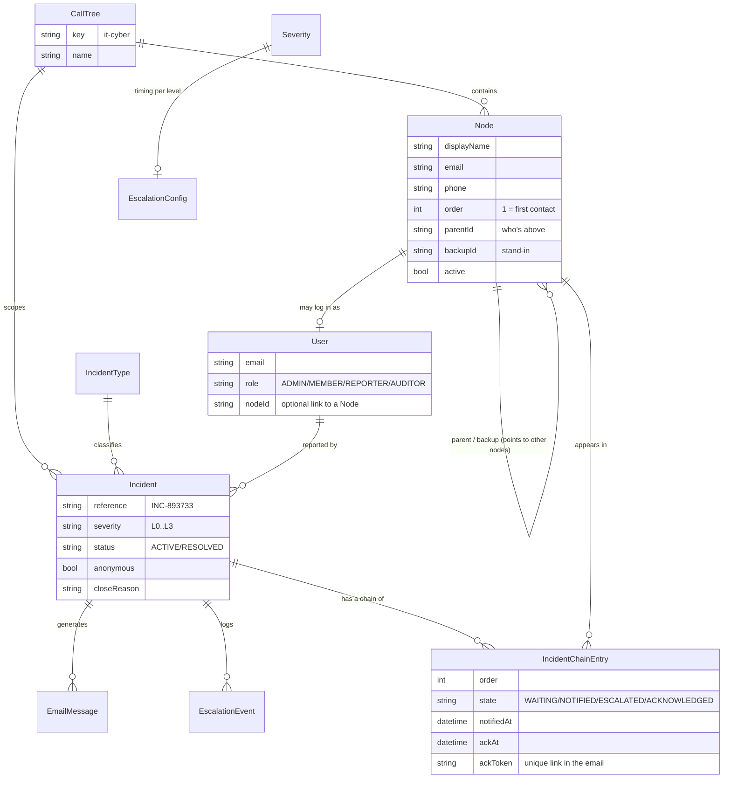
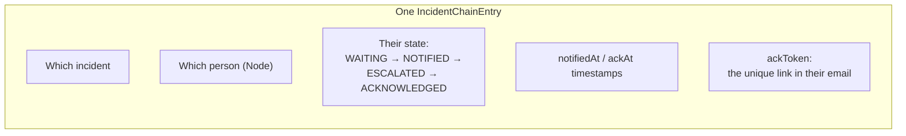

# 04 — Data Model: What We Store and How It Connects

The database is the **memory** of the system. This doc explains, in plain words, what we keep and — most importantly — how the pieces link together. Those links are what make the data trustworthy.

## First, the plain-English inventory

The system stores these kinds of things ("tables"):

| Table | In plain words | Real example |
|---|---|---|
| **User** | A login account | `admin@sentinel.local`, role Admin |
| **CallTree** | A whole escalation chart | "IT/Cyber" |
| **Node** | A *person's position* in a tree | "Prashant Kamble, 1st contact, backup = Nurul" |
| **IncidentType** | A kind of incident + its default severity | "Network outage → L2" |
| **Incident** | One actual reported crisis | "INC-893733, ransomware, L3, active" |
| **IncidentChainEntry** | One person's status *within one incident* | "Prashant — acknowledged at 15:04" |
| **EscalationConfig** | The timing rules per severity | "L3: escalate after 30s, remind every 20s" |
| **EscalationEvent** | Something the engine did | "Escalated to Nurul at 15:03" |
| **EmailMessage** | An alert email that was generated/sent | "To Anupam, subject [SENTINEL] L3…" |
| **AuditUserAction** | A record of something a *person* did | "Admin closed INC-893733" |
| **AuditConfigChange** | A record of a *settings* change | "Admin changed L2 timeout 60s→90s" |
| **AppConfig** | Global settings | reopen window 72h, retention 18 months |

## The one distinction people trip over: Node vs User

This is worth pausing on, because it's the cleverest part of the model.

- A **Node** is a *position in the call tree* — "1st contact, whose backup is Nurul, who reports to nobody." It has a name, email, phone, and an **order** (1, 2, 3…).
- A **User** is a *login account* with a role.

They're **separate on purpose**:
- You can put someone in the call tree (a Node) **before** they've ever logged in — the Admin builds the chart, then the system invites each person to create their account later.
- It keeps **contact privacy** clean: a Member sees the *Nodes* around them (names/emails needed to know the chain) without needing everyone's login accounts.

A User *may* be linked to a Node (the `nodeId` link), but neither requires the other to exist first.

## How everything connects (the map)

This is the entity-relationship diagram — the "family tree" of the data. Lines mean "is linked to."

Don't memorise it — just take away the shape: **a tree contains people (Nodes); an incident runs through a chain of those people; and every alert, email, and action is linked back to its incident.**

## The single most important relationship: the "chain entry"

When an incident is reported, the system creates one **IncidentChainEntry** per person who needs to respond. This little record is the heart of the whole system:

- It's what the **live tree** reads to colour each person green/amber.
- Its **timestamps** are what the **metrics** subtract to get MTTA/MTTR.
- Its **ackToken** is the secret code in the email link — it's tied to *this incident and this person only*, so clicking it can't acknowledge on someone else's behalf.

## Why relational integrity matters here (the real payoff)

Remember from Wave 1 we chose PostgreSQL for "data integrity." Here's what that concretely buys you:

- An **acknowledgement can't exist without an incident** — the database physically refuses to store an orphaned record. No ghost data.
- Each person appears in an incident's chain **only once** (a uniqueness rule on incident+node). No double-counting.
- Each **ackToken is unique** across the whole system — two people can never share a link.
- When an incident is deleted, its chain, events, and emails are cleaned up with it (`onDelete: Cascade`) — no leftover fragments.

In a crisis tool, "the data is always internally consistent" isn't a nice-to-have — it's the difference between a live board you can *trust* and one you have to second-guess.

🎤 **If a stakeholder asks "how do you know the numbers and the live board are accurate?"**
> "Every acknowledgement, email, and event is a database record physically linked to its incident and its person, with the database enforcing those links. The live board and the metrics are read straight from those records and their timestamps — there's no separate copy that can drift out of sync."

## Two things built in from day one for the future

1. **Multi-tree ready.** Every Node and Incident carries a `treeId`. The pilot only uses the "IT/Cyber" tree, but the model already supports adding HR, Facilities, or Regional trees later with **no schema change**.
2. **LDAP-ready fields.** A Node's fields are named to match corporate directory standards (`displayName`, `title`, `mail`, `manager`). So Phase-2 auto-population from Sodexo's Active Directory drops straight in.

🎤 **If a stakeholder asks "will we have to rebuild the database to grow?"**
> "No. Multiple call trees and directory (LDAP) integration were designed into the data model from the start — they're future features, not future rewrites."

## Retention & audit, in the data
- Two **separate** audit logs — one for *user actions*, one for *config changes* — so "who changed the escalation timeout?" is answerable at a glance, apart from operational noise.
- Audit records are **append-only** (the app never edits or deletes them) and retention has an **18-month floor** in `AppConfig`.

---
➡️ Next wave: [05 — Workflows](05_WORKFLOWS.md) (the step-by-step of a real incident, with sequence diagrams)
