# 05 — Workflows: What Actually Happens, Step by Step

Waves 3 shows you the system *in motion*. If you can narrate these flows, you can walk a stakeholder through a live demo with total confidence.

We'll follow one incident from birth to death, then cover the branches (escalation, the email ack, closing, override, re-open).

---

## The whole lifecycle at a glance

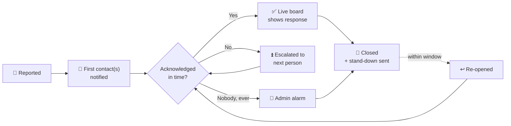

Keep this shape in your head; everything below is a zoom-in on one arrow.

---

## Workflow 1 — Reporting an incident

The reporter does two simple steps; the system does a lot behind the scenes.

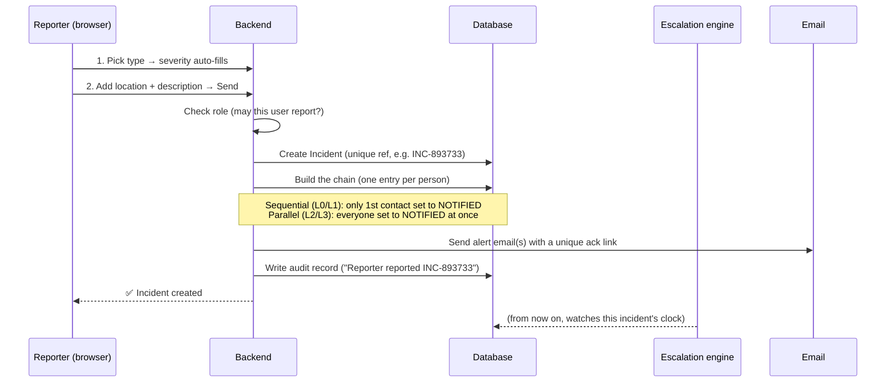

**The one rule that matters here — severity decides the alerting shape:**

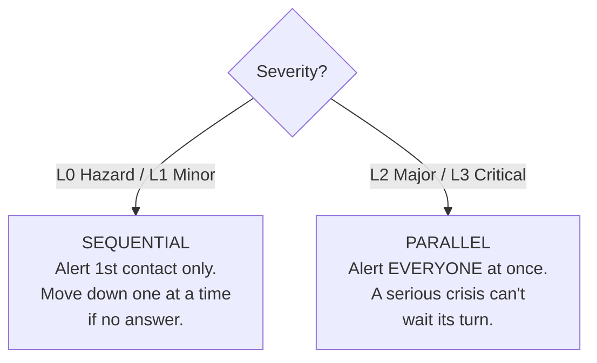

That's why **L2/L3 shows a confirmation dialog** before sending — you're about to alert everybody simultaneously, so the system makes you confirm on purpose.

---

## Workflow 2 — The escalation timeline (the safety net)

This is the flow that runs **by itself**, with no human involved. Say an L1 incident was reported and the first contact isn't responding. Using demo timers (escalate after 30s, remind every 20s):

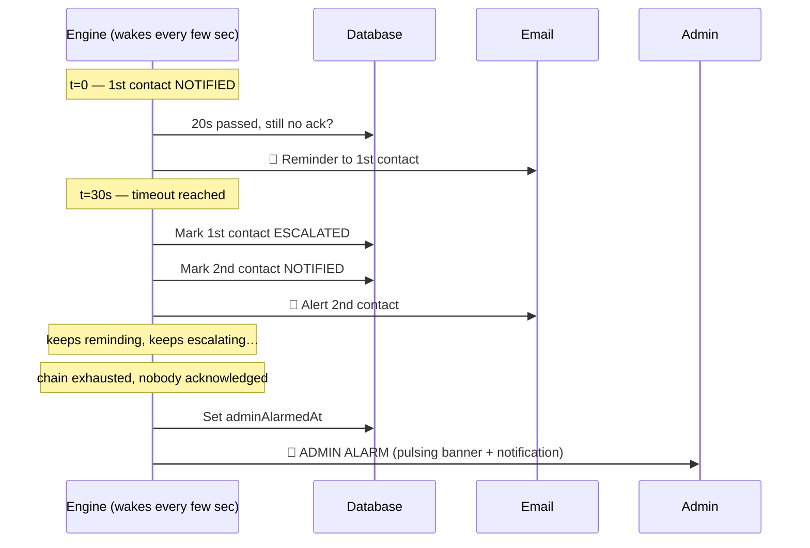

Three things to point out when demoing:
1. **The first person keeps getting reminders even after we escalate past them** — maybe they'll still respond.
2. **Reminders stop** the moment someone acknowledges, or the incident is closed, or the retry cap is hit — no infinite spam.
3. **The admin alarm fires exactly once** — a fully-silent incident can never slip through unnoticed. That's the whole point of the tool.

---

## Workflow 3 — Acknowledging (the two ways)

**Way A — from inside the app** (a logged-in Member/Admin clicks Acknowledge on the live tree):

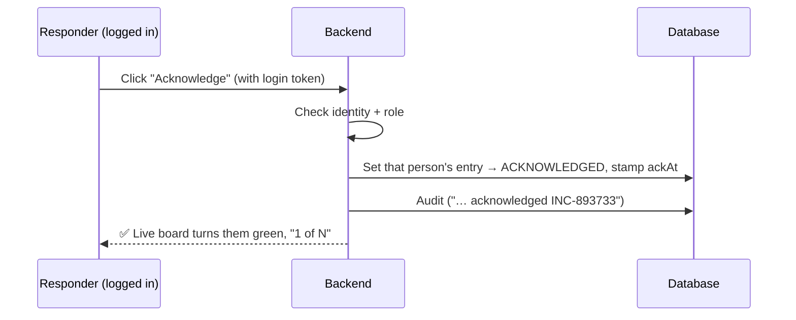

**Way B — straight from the email, no login** (the clever bit for phones):

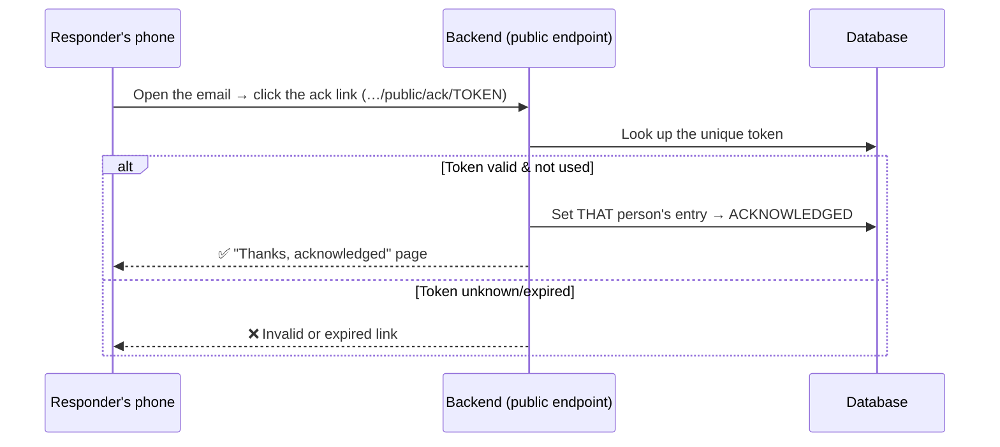

Why this is safe even without a login: the **token is unique to one incident + one person**. It can only acknowledge *that* person for *that* incident — it can't be used to log in, see data, or acknowledge for anybody else. (This is the `ackToken` from the data model in Wave 2.)

> 💡 **This is the exact loop you tested:** you got the real email → clicked the link on this laptop → the live board updated. That was Way B end-to-end.

---

## Workflow 4 — Closing an incident (+ stand-down)

Acknowledging says *"I've seen it."* Closing says *"it's handled."* They're deliberately different (this drives two different metrics — see below).

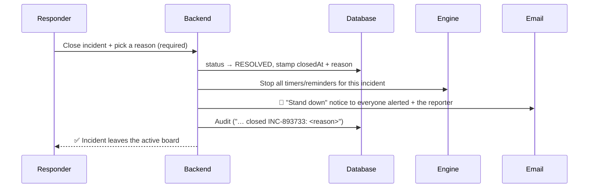

The **stand-down** message matters: without it, people who were alerted keep chasing a problem that's already solved. The system explicitly tells everyone "you can stop now."

---

## Workflow 5 — Override severity (mid-incident re-classification)

Sometimes a "minor" incident turns out to be serious. Anyone in the chain (or an Admin) can re-classify a *live* incident:

```mermaid
flowchart TB
    O["Override L1 → L3<br/>(+ reason)"] --> C{Crosses into<br/>parallel (L2/L3)?}
    C -- Yes --> A["Everyone still WAITING<br/>gets alerted now"]
    C -- No --> N["Just record the change"]
    A --> L["Log who / from→to / reason"]
    N --> L
```

The neat part: if you bump something up to L2/L3, the people who were *waiting their turn* in the sequential chain are **immediately alerted**, because the incident is now "everyone at once."

---

## Workflow 6 — Re-open (recovering a premature close)

If an incident was closed too soon, it can be re-opened — but only within a configured **window** (default 72h), and with rules:

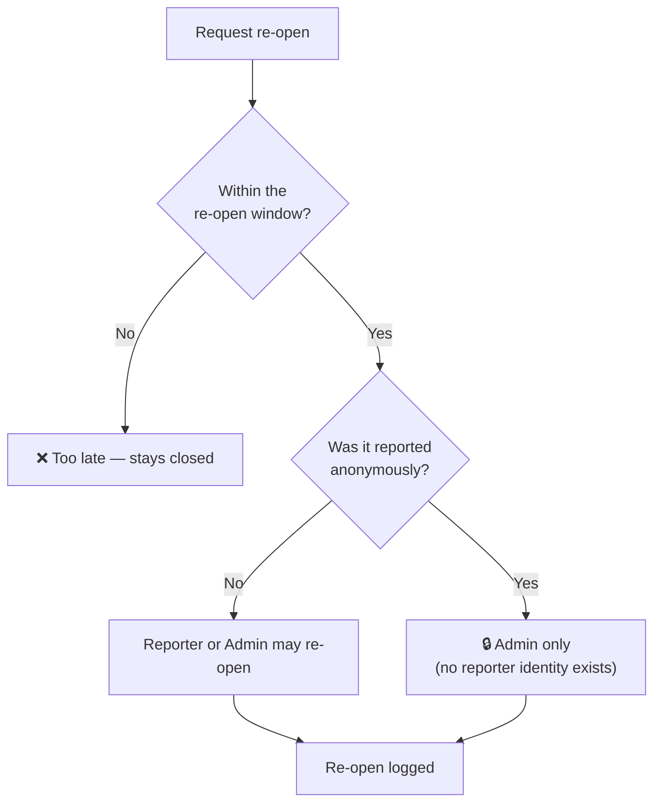

*(One open policy question remains here — whether re-opening restarts escalation from the top or just flips the status back to active. That's flagged for Sodexo to decide; noted in the stakeholder doc.)*

---

## The two state machines underneath it all

Everything above is really just two things changing state. Knowing these two pictures means you understand the entire behaviour.

**A) The incident's status** (simple):
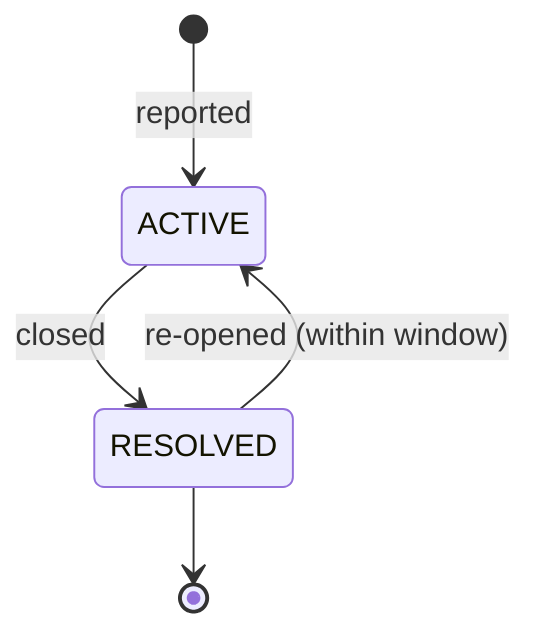

**B) Each person's state within an incident** (the live-board colours):
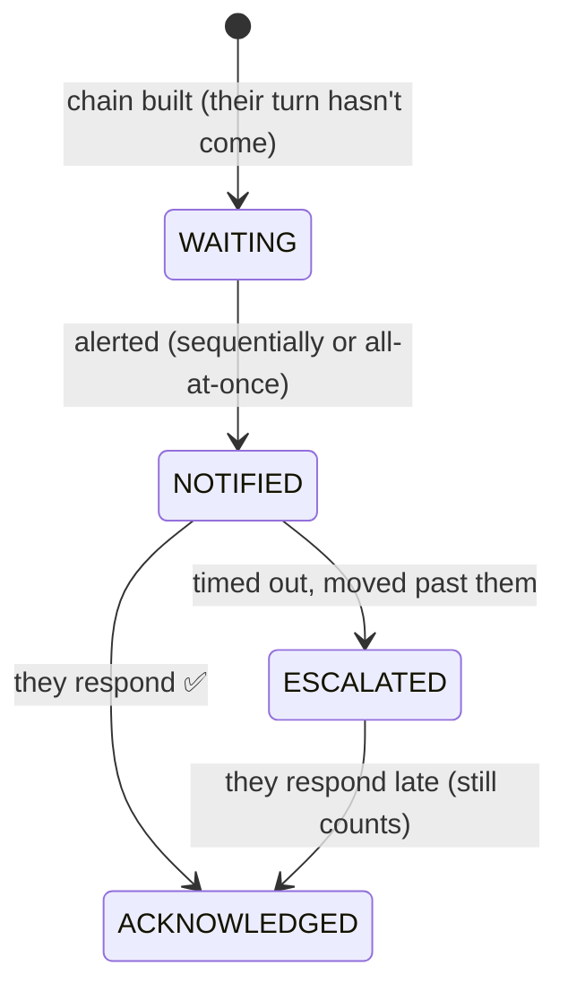

---

## How the workflows produce the metrics

The two different "done" events are why we can measure two different things honestly:

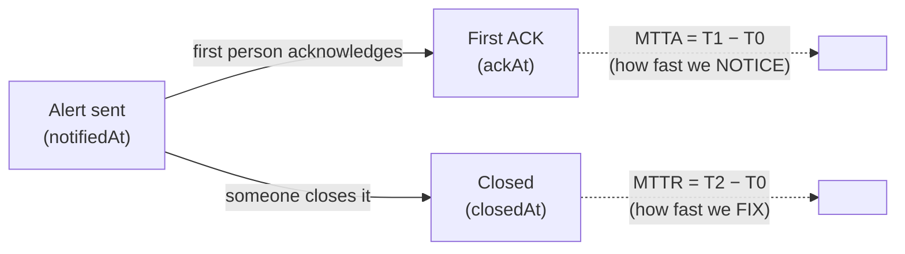

- **MTTA** (Mean Time To Acknowledge) = alert → first acknowledgement = *how quickly the team notices.*
- **MTTR** (Mean Time To Resolve) = alert → close = *how quickly the team fixes it.*

Both are computed from the **real timestamps** the workflows above stamp into the database — never estimated.

🎤 **If a stakeholder asks "why separate Acknowledge from Close?"**
> "Because they answer two different questions: acknowledging tells us how fast someone *noticed* the alert (MTTA), and closing tells us how fast it was *resolved* (MTTR). Merging them would hide half the performance picture."

---
➡️ Next wave: [06 — Design Decisions & Rationale](06_DESIGN_DECISIONS.md) (the *why* behind the rules — including the 9 non-negotiable principles).
