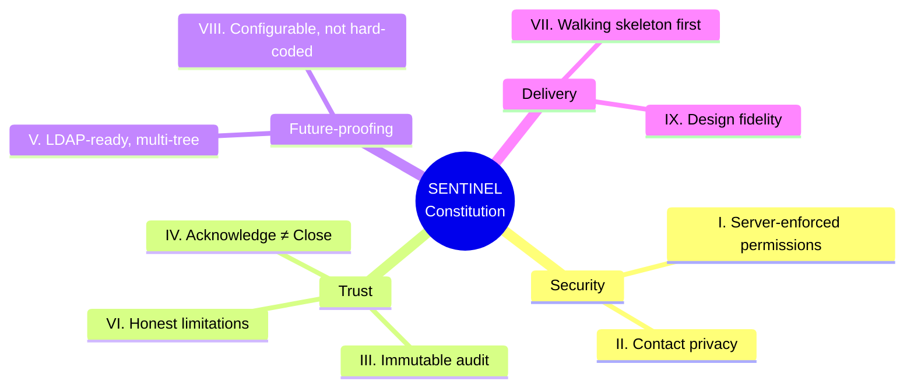

# 06 — Design Decisions & Rationale: *Why* It's Built This Way

Waves 1–5 covered *what* and *how*. This is the **why** — the deliberate choices and the rules the system is forbidden to break. This is the doc that reassures a **security, compliance, or architecture** audience, because it shows the decisions were principled, not accidental.

## Part A — The Constitution: 9 non-negotiable principles

Before a single feature was built, the project agreed a **constitution** — a short list of rules that *every* feature must obey. It lives at `.specify/memory/constitution.md`. Here's each one in plain English, with why it exists.

### 🔒 The three NON-NEGOTIABLE ones (never waived)

**I. Server-Enforced Least Privilege** — Every permission is checked **on the server**, on every request. Hiding a button in the screen is never the only protection; if a forbidden action is called directly, it's still refused (403).
> *Why:* UI-only security is fake security. Anyone can bypass a hidden button. Real protection has to live where the data does — the server. *(This is the guard you saw run first in the Wave 3 diagrams.)*

**II. Contact Privacy by Design** — A Member only ever receives the slice of the tree around them (their manager, backup, direct reports). Everyone's full contact details are Admin-only.
> *Why:* A call tree is a list of people's personal phone numbers and emails. Minimising who can see what is both a privacy duty and a GDPR expectation.

**III. Immutable, Complete Audit** — Every action and every settings change is written to an append-only log, timestamped, and **can't be edited or deleted through the app**. Kept ≥18 months.
> *Why:* When an auditor or regulator asks "who did what, when?", the answer must be trustworthy. A log you can edit is worthless as evidence.

### The other six

**IV. Acknowledge ≠ Close** — Two separate, separately-timestamped events (the whole of Wave 3, Workflow 4).
> *Why:* They measure two different things — noticing (MTTA) vs fixing (MTTR). Merging them hides half the performance picture.

**V. LDAP-Ready, Multi-Tree Data Model** — Fields named to match corporate directories; the schema holds many trees even though only IT/Cyber is used now.
> *Why:* So Phase-2 growth (auto-sync from Sodexo's Active Directory, more departments) is a *drop-in*, not a rebuild. Decided on day one because retrofitting it later would be painful.

**VI. Honest Limitations** — The system never overstates itself. "Delivered" means *the mail provider accepted the message* — nothing stronger. It states plainly that it's a sanctioned pilot, not hardened production.
> *Why:* Credibility. Over-claiming ("guaranteed delivered!") would be a lie that collapses the first time an email lands in spam. Honesty is what makes a security audience trust the *rest* of your claims.

**VII. Walking Skeleton First** — Build the whole thin end-to-end path (report → alert → acknowledge → live status → metrics) *first*, then broaden.
> *Why:* It proves the hardest part — the pieces actually connecting end-to-end — early, instead of discovering integration problems at the end.

**VIII. Configurable, Not Hard-Coded** — Timeouts, reminder intervals, retry counts, severity mappings, the re-open window — all Admin-editable settings, not values buried in code.
> *Why:* Sodexo's policy ("escalate after 5 minutes") will differ from any guess, and will change over time. Baking timings into code would mean a developer + redeploy for every policy tweak.

**IX. Design Fidelity to the Approved Prototype** — The UI reproduces the prototype that stakeholders already approved; visual changes need sign-off.
> *Why:* The look was already validated with stakeholders. Redesigning it unilaterally would throw away that agreement.

🎤 **If a stakeholder asks "how do I know this was built responsibly?"**
> "There's a written constitution of nine binding principles — server-enforced security, contact privacy, and an immutable audit trail are marked non-negotiable and were never waived. Every feature was checked against it. It's version-controlled alongside the code."

---

## Part B — Key design trade-offs (the choices behind the choices)

Beyond the constitution, here are the notable "we did X instead of Y, because…" decisions. Being able to explain a trade-off — including what you *gave up* — is what makes you sound like you own the system.

| Decision | We chose | Over | Why | The honest trade-off |
|---|---|---|---|---|
| **Live board updates** | Short polling (refresh every few seconds) | Websockets (instant push) | Far simpler, robust, works through corporate proxies; "a few seconds" is plenty for a call tree | A ~2–3s lag vs truly instant. Fine here; can upgrade later |
| **Email link acknowledge** | A unique per-incident token, no login | Forcing login to acknowledge | Responders acknowledge in one tap from a phone at 3am | The link must be kept secret (it's single-purpose & can't do anything else, which limits the risk) |
| **Email default mode** | "Mock" (in-app inbox, sends nothing) | Real sending by default | Safety — you can't accidentally email real people during testing | You must consciously switch to real mode (a feature, not a bug) |
| **Password hashing** | bcryptjs (pure JavaScript) | argon2 (slightly stronger, native) | Installs with no admin rights on the locked-down laptop | Marginally less modern; noted to revisit for production |
| **Connection style** | REST | GraphQL/tRPC | Universally understood, easiest to maintain and integrate | Less flexible querying — unnecessary at this scale |
| **One repo (monorepo)** | Frontend + backend together | Two separate repos | Shared type definitions; one clone, one version | Slightly larger repo; irrelevant at this size |
| **Sequential vs parallel** | Severity decides (L0/L1 one-at-a-time, L2/L3 all-at-once) | Always-parallel or always-sequential | Matches real crisis behaviour: don't wake everyone for a minor issue; don't make a critical one wait in line | More logic to build & test — worth it |
| **Escalation engine** | A pure `processDue(now)` function + a simple timer | A heavyweight job-queue system (e.g. BullMQ) | Testable (feed it a fake time), crash-recoverable from the database, no extra infrastructure | At massive scale a dedicated queue is better; not needed for a pilot |

🎤 **If a stakeholder asks "why not use websockets / GraphQL / the fancy option?"**
> "We deliberately chose the simpler, more robust option at every point, because a crisis tool's top priorities are reliability and maintainability, not cutting-edge complexity. Each simpler choice has a clear upgrade path if a real need appears."

---

## Part C — Honest limitations (say these *before* you're asked)

Volunteering the limits is a credibility superpower. Principle VI in action:

- **"Delivered" ≠ "read."** We know the mail provider *accepted* the message; we don't claim the person read it. (That's exactly why escalation and the admin alarm exist — they don't rely on trusting delivery.)
- **This is a pilot, not hardened production.** It's a real, working, sanctioned application, but going live company-wide needs Sodexo's mail relay, managed hosting with backups/DR, SSO, a security review, and legal/GDPR sign-off — all itemised in [STAKEHOLDER_DISCOVERY.md](../Spec/STAKEHOLDER_DISCOVERY.md).
- **Email only for now.** SMS, WhatsApp, and a mobile app are deliberately Phase 2.
- **Clock-time escalation.** Phase 1 escalates on wall-clock time; business-hours-aware chains are Phase 2.
- **A few policy questions are Sodexo's to answer**, not ours to guess — e.g. exact timer values, the real incident-type list, and whether a re-open restarts escalation. These are flagged, not invented.

🎤 **If a stakeholder asks "what *can't* it do yet?"**
> "It's email-only, it escalates on clock time, and it's a sanctioned pilot rather than hardened production — going company-wide needs standard enterprise gates like SSO, a security review, and Sodexo's mail relay. None of that is a redesign; it's infrastructure and sign-off. We list all of it openly."

---

## The through-line
Every decision in this document points the same way: **be trustworthy, be honest, be simple enough to last, and be ready to grow.** That's not an accident — it's the constitution doing its job.

---
➡️ Next wave: [07 — Epics & Stories](07_EPICS_AND_STORIES.md) (the full feature list, explained simply).
