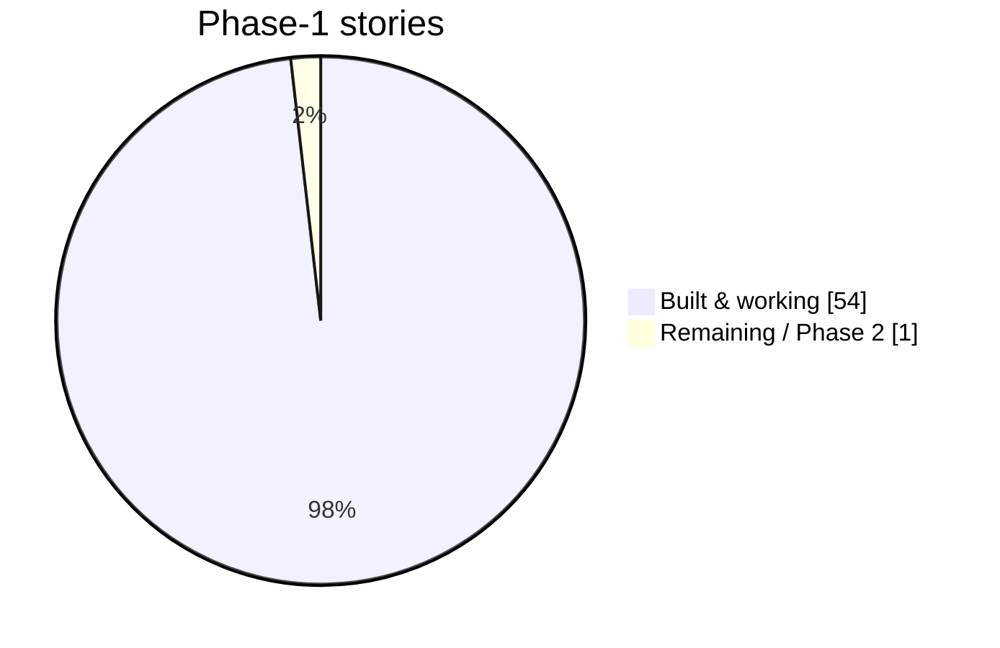
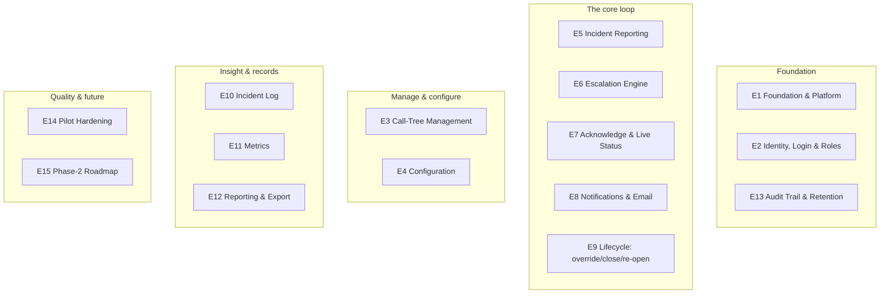
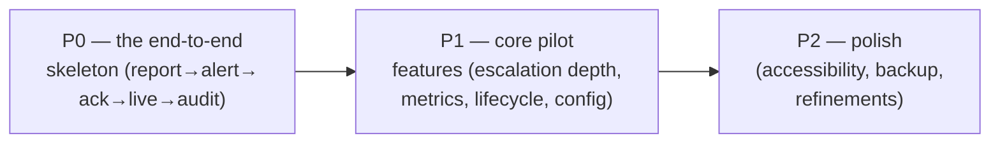

# 07 — Epics & Stories: The Features, Explained Simply

This is the **map of everything the system does**, in plain language. In agile terms:
- An **Epic** = a big area of capability (e.g. "Call-Tree Management").
- A **Story** = one specific thing a user can do within it (e.g. "an Admin can add a person").

The full, formal backlog is in [Spec/EPICS_AND_STORIES.md](../Spec/EPICS_AND_STORIES.md) (15 epics, ~55 stories, each traced to the spec). This doc is the **friendly tour** of it.

## How much is built?

**11 features shipped**, ~54 of ~55 Phase-1 stories complete, backed by an end-to-end test suite. The one deliberately-open item is a Sodexo policy decision (re-open behaviour), not missing code.

## The 15 epics grouped by theme

---

## The epics, one by one (in plain words)

### E1 — Foundation & Platform *(the groundwork)*
The invisible scaffolding: the project skeleton, the permanent database with proper timestamps, consistent API rules, a health-check, and **seed data** (the IT/Cyber tree + incident types + default settings) so the app is usable the moment it starts.
> *Why it matters:* everything else stands on this. Built multi-tree-ready from line one.

### E2 — Identity, Login & Role-Based Access *(who you are, what you may do)*
Real logins replace the prototype's fake role-switch. Four roles, each enforced **on the server**. Plus the **invitation-based onboarding**: an Admin adds a person by email, that person is invited to set up their own login and fill in *their own* contact details — with **consent capture** for GDPR. Login is built to swap to **Sodexo SSO** later.
> *The rule:* a forbidden action is refused even if called directly — not just hidden.

### E3 — Call-Tree Management *(the org chart of who-to-call)*
Admins build and maintain the chain: **add / edit / remove / reorder** people, set each person's **backup** and **who they report to**. Members see only **their slice** (privacy). Plus **leave/vacation cover** (swap in a stand-in), **CSV upload** to build the tree in bulk (fully validated — rejects a bad file rather than half-importing), a **sample template** download, and **export** of the whole matrix.
> *This is the "call tree" itself — the heart of who gets alerted.*

### E4 — Configuration *(the tunable dials)*
Admin-editable settings, every change audit-logged: which **severity** each incident type defaults to; the **escalation timing** per level (escalate-after, remind-every, retry-cap); and general settings (**re-open window**, **retention**). A **short-timer demo profile** lets escalation play out in seconds for a live demo.
> *Principle VIII in action — no timings hard-coded.*

### E5 — Incident Reporting *(raising the alarm)*
The two-step report: pick a **type** (severity auto-fills) → add **location + description** → send. Plus **severity override** at report time, **anonymous reporting** (with a clear warning), a **confirmation step for L2/L3** (because those alert everyone at once), and a **direct link + incident ID** in every alert so responders ack the right one.

### E6 — Escalation Engine *(the automatic safety net)*
The background brain (Wave 3, Workflow 2): **sequential vs parallel** dispatch by severity, **escalate on timeout**, **reminders** until a retry cap, the **admin "nobody responded" alarm**, and **timer durability** (survives a restart). *This is the highest-risk component, so it's built and tested in isolation.*

### E7 — Acknowledgement & Live Status *(the anti-rumour view)*
The **live escalation tree**: who's been alerted vs who's acknowledged, colour-coded, "X of N acknowledged", updating in near-real-time. **Acknowledge** is independent and timestamped; **ACK and Close are distinct**; you can track **multiple active incidents** at once.

### E8 — Notifications & Email Delivery *(reaching people + the running story)*
**Email alerts** via a swappable provider (test sender now → Sodexo mail later), the **one-click acknowledge link** (no login), the **stand-down** notice on close, an in-app **notifications feed** (the whole story), and **chain-change** notifications when someone is added/covered.

### E9 — Incident Lifecycle *(override / close / re-open)*
Re-classify a live incident's **severity** (auto-alerting newly-included people), **close with a required reason** (stops timers, sends stand-down), and **re-open within the window** (with the anonymous-incident rule). *Wave 3, Workflows 4–6.*

### E10 — Incident Log & Records *(the full history)*
The **incident log** (Admin/Auditor see all; Reporter sees only their own; Auditor gets a read-only timeline) and **≥18-month retention**.

### E11 — Metrics *(are we getting faster?)*
**MTTA / MTTR / total completion time**, **delivery & acknowledgement rates**, **per-hop latency with the "breaking node"** flagged (where chains stall), and **team-scoped** metrics for Members. All from real timestamps.

### E12 — Reporting & Export *(share it upward)*
Download an incident as a **PDF** (timeline + metrics) or data as **CSV**.

### E13 — Audit Trail & Retention *(the evidence)*
**Every user action** logged, **every config change** logged **separately**, both **immutable** and viewable/exportable, retained ≥18 months. *Principle III.*

### E14 — Non-Functional & Pilot Hardening *(responsible pilot basics)*
**Authorization tests** proving role enforcement on every endpoint, **input validation & rate-limiting** on the public ack link, **secrets hygiene** (nothing sensitive in the repo), backup/restore, accessibility basics, and an **honest-limitations notice**.

### E15 — Phase-2 Roadmap *(captured, deliberately not built)*
LDAP/AD auto-sync, scheduled matrix distribution, business-hours chains, more call trees, SMS/WhatsApp, and a **mobile app**. *The data model is already shaped to accept these without a rewrite.*

---

## Priorities: how the order was decided

Features were tagged by priority and built in a "walking skeleton first" order (Principle VII):

- **P0** = the thin end-to-end path that had to work first.
- **P1** = the features needed for a real pilot sign-off.
- **P2** = refinements that can trail without blocking the pilot.

🎤 **If a stakeholder asks "what's actually finished?"**
> "The full Phase-1 scope — reporting, the automatic escalation engine, live acknowledgement, email with one-click ack, the call-tree management, configuration, metrics, exports, and a complete immutable audit trail. Around 54 of 55 stories, all backed by automated tests. The single open item is a policy decision that's yours to make, not missing functionality."

🎤 **If a stakeholder asks "how do you track scope so nothing's missed?"**
> "Every feature is a numbered story traced back to a section of the signed-off spec. Nothing gets built that isn't in the backlog, and nothing in the backlog gets silently dropped — it's all version-controlled."

---
➡️ Final wave: [08 — Stakeholder Q&A](08_STAKEHOLDER_QA.md) (every likely question, with a ready answer).
